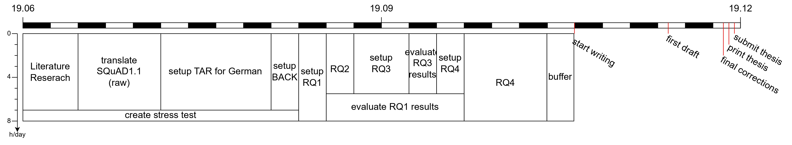
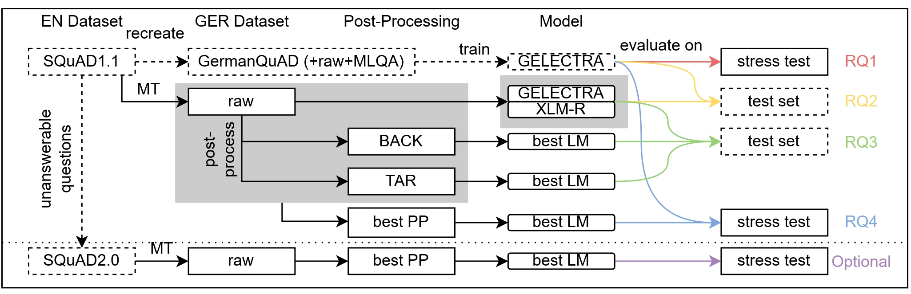

# Thesis
Repository containing the material for my master thesis

## Timeplan

## Approach

## Stress Test
- [x] OOD - Out of Domain: German parts of MLQA and XSQuAD
- [ ] NOT - Unanswerable Questions: (50-100) unanswerable questions on the GermanQuAD testset
  - maybe 3 levels of difficulty:
    - 1. Answer to Question is by no means in the text
    - 2. Answer is in the text but the context does not fit
    - 3. Question is not answerable due to small details
- [ ] DIS - Distracting Content: (25-50) short contexts from GermanQuAD testset extended with some distracting context
- [ ] ONE - Question Reduction: (50-100) Questions from GermanQuAD reduced to a single word
- [ ] SDT - SQuAD testset MT: MT version of the SQuAD(2.0) testset
